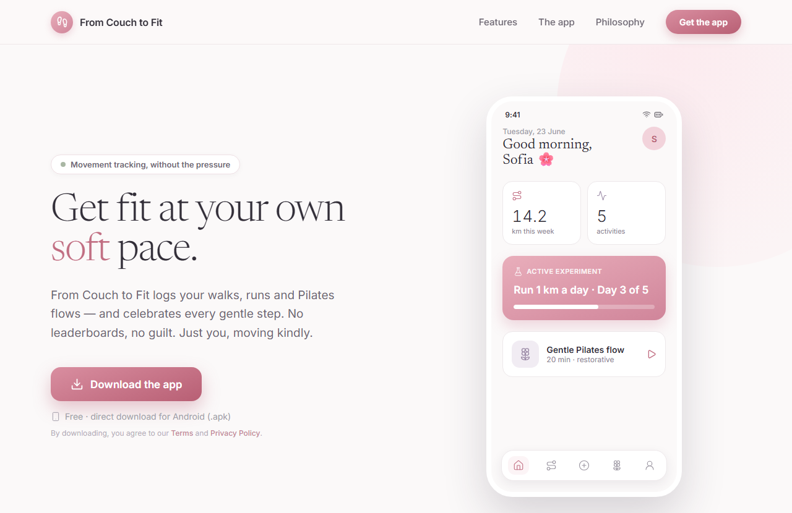
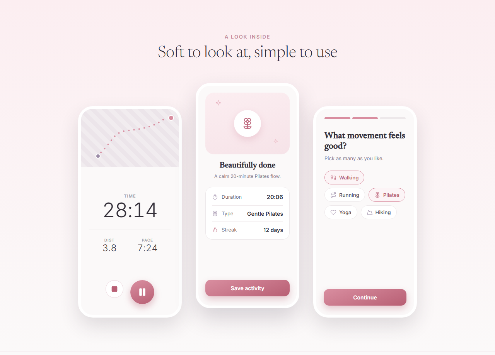

# From Couch to Fit 🌸

**Movement tracking, without the pressure.**

A gentle fitness app for Android that logs your walks, runs and Pilates flows, and celebrates every step. No leaderboards, no guilt. Just you, moving kindly.

🌐 **[Landing page](https://mariaorfanelli.github.io/from-couch-to-fit/)** · 📱 **[Download the APK](https://github.com/mariaorfanelli/from-couch-to-fit/releases/latest/download/from-couch-to-fit.apk)**

[](https://mariaorfanelli.github.io/from-couch-to-fit/)

## What it does

- **Track every kind of movement.** Walks, runs and hikes with live GPS route tracking, plus Pilates, yoga and strength sessions logged manually or from a curated class list.
- **AI plans for your goals.** Name an objective, like "run 6 km" or "reach 7:10 pace", and a coach builds a gentle week-by-week plan you can follow in the app.
- **Run/walk intervals.** Guided intervals ("walk 1 min, run 30 s") that buzz and chime at every switch, even with the screen off.
- **Tiny experiments.** Small, time-boxed promises like "run 1 km a day for five days", with a note on how each session felt and a wrap-up of what you learned.
- **Honest trends.** Weekly distance, pace and consistency that answer "am I getting fitter?" without comparing you to anyone.
- **Celebrations, not comparisons.** Every finished activity ends in a warm, restful summary.



## How it's built

| Layer | Stack |
| --- | --- |
| Mobile app | [Expo](https://expo.dev) SDK 54 · React Native 0.81 · TypeScript · expo-router |
| GPS tracking | expo-task-manager + Android foreground service, works with the screen off, with session recovery |
| Maps | Google Maps SDK for Android, custom calm map style |
| Auth & data | [Supabase](https://supabase.com) (email/password + Google OAuth), activities persisted locally in AsyncStorage and mirrored to Postgres |
| AI plans | Supabase Edge Function (Deno) calling DeepSeek, the API key lives server-side only |
| Distribution | EAS Build APK, published as a GitHub Release and served by the landing page |
| Landing page | Static HTML/CSS on GitHub Pages, the phone mockups are pure CSS |

The repo is a pnpm workspace:

```
artifacts/mobile/     the Expo app (screens, tracking, maps, theming)
supabase/functions/   deepseek-plan edge function (AI training plans)
docs/                 landing page + legal pages (GitHub Pages)
```

## Running it locally

```bash
pnpm install
cd artifacts/mobile
pnpm exec expo start        # dev preview in Expo Go (foreground GPS only)
```

Copy `.env` values first: `EXPO_PUBLIC_SUPABASE_URL` and `EXPO_PUBLIC_SUPABASE_ANON_KEY` point at your Supabase project. Background GPS needs a standalone build, which is why the app ships as an APK:

```bash
eas build -p android --profile preview
```

## Philosophy

> Other apps shout. We simply open the door, gently, and say *whenever you're ready.*

## License

[MIT](https://opensource.org/licenses/MIT) · Made by [Maria Orfanelli](https://mariaorfanelli.com.br)
